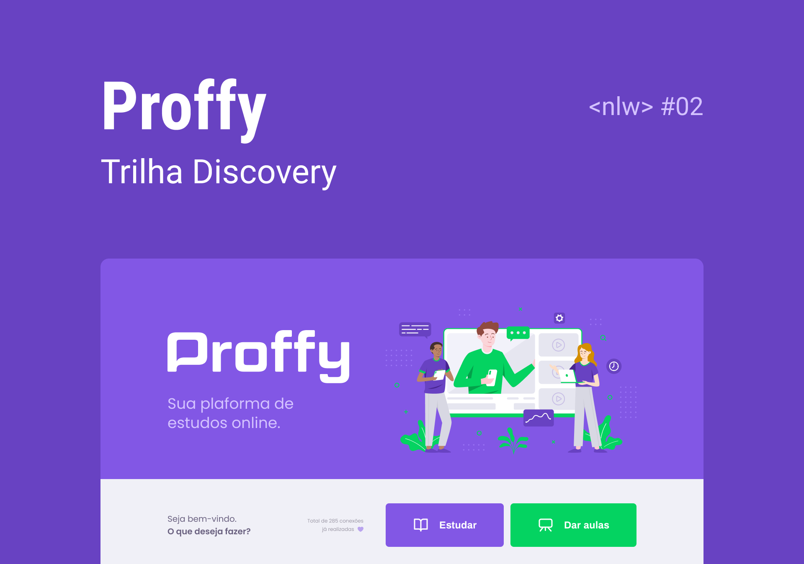

<h2 align="center">
    
    
Sua plataforma de estudos online

</h2>

  

  

  	
  
	
  
  

  
   

<h1 align="center">
    
</h1>

### 📜 Sobre
Projeto desenvolvido durante o **NLW** oferecido pela [Rocketseat] :rocket:.

Este é uma plataforma de estudos online.
Construído com as tecnologias mais populares do mundo Javascript, este repositório contem uma API REST (Node.js) como backend, uma aplicação em ReactJS como frontend e um app mobile em React Native.

A aplicação em Node.js (backend) é uma API REST escrita em Node.JS que serve dados ao frontend e ao mobile. 
A aplicação em ReactJS (web) e em React Native (mobile) é onde o usuário pode se conectar a um professor ou aluno. 
